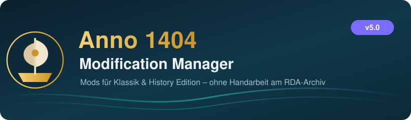
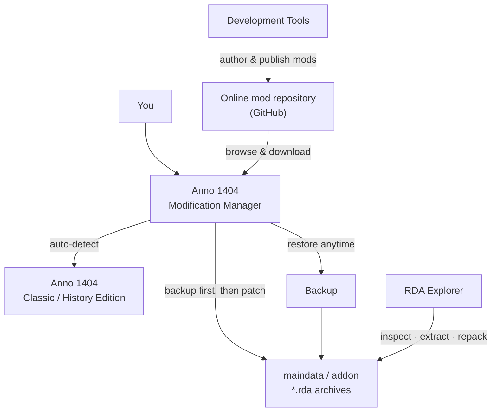

<div align="center">



<h3>Install, manage &amp; build mods for <a href="https://www.ubisoft.com/game/anno/1404-history-edition">Anno 1404</a> — <b>Classic</b> and <b>History Edition</b> — without ever touching an <code>.rda</code> archive by hand.</h3>


**[What &amp; why](#-what-is-this)** ·
**[Features](#-features)** ·
**[The three tools](#-three-tools-one-suite)** ·
**[How it works](#-how-it-works)** ·
**[Install](#-installation)** ·
**[Build](#%EF%B8%8F-building)** ·
**[FAQ](#-troubleshooting)** ·
**[Credits](#-credits)** ·
**[Deutsch](#-deutsch)**

</div>

---

## 🏰 What is this?

Anno 1404 ships its game data inside packed **`.rda` archives** (`maindata/`, `addon/`).
Installing a mod by hand means unpacking those archives, dropping files in the right
place, repacking, and praying you kept a backup. One typo and the game won't start.

**Anno 1404 Modification Manager** does all of that for you. Browse mods, click *activate*,
play. It detects your installation, patches the right archives, and **always makes a backup
first** so a single click puts everything back.

It works with both the **classic** retail/Venice version and the **History Edition** on
Ubisoft Connect, and it comes with a full **mod-authoring toolkit** and an **RDA archive
explorer** built in.

> [!NOTE]
> Nothing is cracked or pirated. The manager edits the game's own data archives the same
> way the game reads them, and keeps a restore point for every change.

## ✨ Features

- 🧭 **One-click mod management** — activate, deactivate and remove mods from a single list.
- ♻️ **Safe by default** — automatic backup of original archives, full restore anytime.
- 🌐 **Online mod browser** — discover and download community mods straight from a
  GitHub-hosted repository, no separate downloads or extraction.
- 🎮 **Classic *and* History Edition** — auto-detects the game (Ubisoft Connect / registry /
  common paths) and picks the right archives; existing classic mods stay usable on HE.
- 🗜️ **Integrated RDA Explorer** — open, browse, extract and repack `.rda` archives
  (RDA v2.0 **and** v2.2).
- 🛠️ **Development Tools** — author, edit, package and publish your own mods.
- 🌍 **Bilingual UI** — German &amp; English.
- 🪟 **Native Windows app** — WPF on .NET Framework, plus a ready-made installer.

## 🧰 Three tools, one suite

| Tool | What it's for |
|------|---------------|
| 🏰 **Modification Manager** | The main app: browse, install, activate/deactivate mods, manage backups. |
| 🗜️ **RDA Explorer** | Open Anno's `.rda` archives directly — inspect, extract, and repack files. |
| 🛠️ **Development Tools** | Build mods: edit `ModificationInfo`, XML/List modules, convert old projects, package, and publish. |

## 🧠 How it works



1. **Detect** — the manager finds your Anno 1404 install (Ubisoft Connect game registry,
   classic registry, or by picking the `.exe`) and identifies the version.
2. **Browse &amp; download** — the mod browser lists packages from the online repository and
   fetches the ones you want.
3. **Activate** — applying a mod rewrites only the affected `.rda` archives, **after** copying
   the originals to a backup. Deactivating or restoring puts them back byte-for-byte.

## 📦 Installation

> **You need Anno 1404 installed** — classic (Anno4.exe / Addon.exe) or the History
> Edition (Anno1404.exe / Anno1404Addon.exe).

**Option A — Installer (recommended)**

1. Grab `AMM5_Setup_*.exe` from the [Releases](https://github.com/C1yHAX/Anno-1404-Modification-Manager-v5/releases) (or build it, see below).
2. Run it — it installs to *Program Files* and adds Start-menu shortcuts (Manager,
   Development Tools, RDA Explorer). It checks for **.NET Framework 4.7.2**.
3. Launch the manager; it auto-detects your game on first start.

**Option B — From source** — see [Building](#%EF%B8%8F-building).

## 🛠️ Building

<details>
<summary><b>Visual Studio (recommended)</b></summary>

**Requirements:** Windows · Visual Studio 2022/2026 with the *“.NET desktop development”*
workload · the **.NET Framework 4.7.2** targeting pack.

1. Open `a1404mm-code-r23/AnnoModificationManager5/AnnoModificationManager5.sln`.
2. Set the configuration to **Release | x86**.
3. **Build → Rebuild Solution.** Output lands in
   `…/AnnoModificationManager5/bin/Release/`.

> Tip: if you debug with **F5** and hit a startup crash, turn off
> *Tools → Options → Debugging → Enable UI Debugging Tools for XAML* (a known Visual
> Studio quirk with some WPF apps), or just **Start Without Debugging (Ctrl+F5)**.
</details>

<details>
<summary><b>Installer (Inno Setup)</b></summary>

Build the solution first, then compile
[`Installer/AnnoModificationManager5.iss`](a1404mm-code-r23/AnnoModificationManager5/Installer/AnnoModificationManager5.iss)
with [Inno Setup 6+](https://jrsoftware.org/isdl.php):

```text
"C:\Program Files\Inno Setup 7\ISCC.exe" AnnoModificationManager5.iss
→ Installer\Output\AMM5_Setup_<version>.exe
```
</details>

## 🗂️ Project structure

```text
a1404mm-code-r23/
└─ AnnoModificationManager5/
   ├─ AnnoModificationManager5.sln      ← open this
   ├─ AnnoModificationManager5/         ← the main manager (WPF app)
   ├─ DevelopmentTools/                 ← mod-authoring toolkit
   ├─ AnnoModificationManager/          ← legacy DTOs (project conversion)
   └─ Installer/                        ← Inno Setup script + readme
RDAExplorer/                            ← RDA archive library
RDAExplorerGUI/                         ← standalone RDA Explorer window
libs/                                   ← bundled managed dependencies
```

## ❓ Troubleshooting

<details>
<summary><b>The game wasn't detected</b></summary>

Open *Settings* and pick your Anno 1404 folder (or the `.exe`) manually. The manager
remembers it. History Edition lives under your Ubisoft Connect *games* folder; the classic
version under its Ubisoft install directory.
</details>

<details>
<summary><b>A mod broke my game</b></summary>

Deactivate it, or use **Restore** to roll back to the backup the manager made before
applying. As a last resort, verify the game files via Steam/Ubisoft Connect.
</details>

<details>
<summary><b>The online mod browser is empty</b></summary>

It lists mods from the configured GitHub repository. If it's empty, the repository has no
published packages yet, or there's no internet connection — the manager falls back to its
local cache.
</details>

## 🙏 Credits

- 🗜️ **[RDAExplorer](https://github.com/lysannschlegel/RDAExplorer)** — the open-source RDA
  archive library/GUI that powers reading and writing Anno's `.rda` files.
- 🏰 Built on the long-running **Anno 1404 Modification Manager** project and the work of the
  Anno modding community.

## ⚖️ License &amp; disclaimer

See [`LICENSE`](LICENSE). Bundled third-party components (RDAExplorer and the libraries in
`libs/`) keep their own licenses.

Provided as-is, no warranty. Game mods can break with updates — if something misbehaves,
deactivate the mod, restore the backup, and verify your game files.

---

## 🇩🇪 Deutsch

**Anno 1404 Modification Manager** installiert und verwaltet Mods für **Anno 1404** –
**Klassik** und **History Edition** – ohne dass du je ein `.rda`-Archiv von Hand anfassen
musst. Mod aussuchen, auf *Aktivieren* klicken, spielen.

**Funktionen**
- 🧭 Mods mit einem Klick aktivieren/deaktivieren/entfernen.
- ♻️ Automatisches Backup vor jeder Änderung, jederzeit wiederherstellbar.
- 🌐 Online-Mod-Browser (Pakete aus einem GitHub-Repository laden).
- 🎮 Erkennt Klassik **und** History Edition automatisch; klassische Mods bleiben unter HE nutzbar.
- 🗜️ Integrierter **RDA Explorer** (RDA v2.0 und v2.2 lesen/schreiben).
- 🛠️ **Development Tools** zum Erstellen, Paketieren und Veröffentlichen eigener Mods.
- 🌍 Deutsch &amp; Englisch.

**Voraussetzung:** Anno 1404 muss installiert sein (Klassik oder History Edition).

**Installation:** `AMM5_Setup_*.exe` ausführen (installiert nach *Programme*, legt
Startmenü-Verknüpfungen an, prüft auf **.NET Framework 4.7.2**) – oder selbst bauen.

**Bauen:** `a1404mm-code-r23/AnnoModificationManager5/AnnoModificationManager5.sln` in
Visual Studio öffnen, **Release | x86** wählen, *Projektmappe neu erstellen*. Optional den Installer mit **Inno Setup** aus
`Installer/AnnoModificationManager5.iss` kompilieren.
*(Startet im Debugger ein Absturz? In VS „UI-Debugging-Tools für XAML" deaktivieren oder
mit `Strg+F5` ohne Debugger starten.)*

**Spiel wird nicht erkannt?** In den *Einstellungen* den Anno-1404-Ordner bzw. die `.exe`
manuell wählen.

**Credits:** Basiert auf dem Open-Source-**RDAExplorer** und der Arbeit der Anno-Modding-
Community. Lizenz: siehe [`LICENSE`](LICENSE). Ohne Gewähr.
